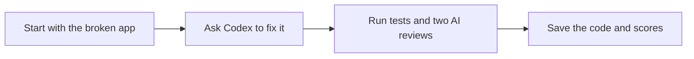

# Fix a customer export with Agentflow

This small app has a bug. It shows 103 active customers, but its CSV download only includes one page. Names and notes with commas or quotes can also break the file. CSV is a file format you can open in a spreadsheet.

The task is to fix the download and add a preview. The preview should show how many customers will be in the file, plus a sample of up to five rows.

**This repo is the starting point.** The [after repo](https://github.com/koji98/agentflow-customer-export-after) has the app from a real Agentflow run and all its saved results.

## What this demo shows

Codex writes the code. Agentflow runs the steps, checks the work, and saves the results.



The tests check facts, such as whether all 103 customers are in the file. Two AI judges check things that need judgment: Is the code easy to follow? Is the preview clear?

Agentflow can ask for another try if a check fails. The saved run passed on its first try. See [how the workflow works](showcase/AUTHORING.md) for the full diagram and scoring rules.

## Choose where to start

| I want to… | Go here |
| --- | --- |
| Try the broken app | Follow the steps below |
| Run Agentflow on it | [Run the workflow](showcase/RUN.md) |
| See the saved result | [Open the after repo](https://github.com/koji98/agentflow-customer-export-after) |
| Understand the files | [Read the file guide](showcase/README.md) |

## 1. Get the tools

You need [Git](https://git-scm.com/downloads), [nvm](https://github.com/nvm-sh/nvm#installing-and-updating), and [Python 3.10 or later](https://www.python.org/downloads/). nvm installs the right Node.js version for this app: **24.18.0**.

Use a Bash or Zsh terminal on macOS or Linux. On Windows, use WSL2, which gives you a Linux terminal. These steps do not cover PowerShell.

You do not need a database, Docker, or an `.env` file. You only need an AI account if you choose to run Agentflow.

## 2. Start the app

Paste these commands into your terminal:

```sh
git clone https://github.com/koji98/agentflow-customer-export-before.git
cd agentflow-customer-export-before
nvm install
nvm use
npm ci
npm run doctor
npm start
```

`doctor` checks your tools. It should print `Environment checks passed`.

Open **http://127.0.0.1:4317** in your browser. Keep the terminal open while you use the app. Press **Ctrl+C** when you want to stop it.

If a command fails, use the [setup help](showcase/SETUP.md).

## 3. See the bug

1. Choose **Active** in the status filter.
2. Go to page two. There are **103** matching customers across all pages.
3. Download the CSV. It only has one page of customers.

The app uses 137 made-up customers. No real customer data is needed.

## 4. Check the starting point

Stop the app with Ctrl+C. Stay in this repo's folder and run:

```sh
npm test
npm run check:acceptance
```

| Check | What you should see |
| --- | --- |
| `npm test` | All 6 app tests pass. They miss the export bug. |
| `npm run check:acceptance` | 16 of 29 checks pass. The command ends with an error. |

**Those 13 failed checks are expected.** Eight find export bugs. Five find that the preview is missing, so they report HTTP 404.

If you see a missing tool or a permission error, fix that first with the [setup help](showcase/SETUP.md).

Ready to let Agentflow work on it? Follow [Run the workflow](showcase/RUN.md). The latest recorded run took **12 minutes and 52 seconds**.

## More detail

- [How the workflow works](showcase/AUTHORING.md): the steps and what each judge checks.
- [File guide](showcase/README.md): what belongs in each folder.
- [Where this example came from](showcase/PROVENANCE.md): versions and saved Git copies.

The original instructions for the AI are in [TICKET.md](TICKET.md), [EXPORT_PREVIEW.md](EXPORT_PREVIEW.md), [APP_GUIDE.md](APP_GUIDE.md), and [AGENTS.md](AGENTS.md). We keep their exact wording so later runs have the same task.

This is an **open-book demo**. The agent can read these guides and the task checks. See the [fairness audit](https://github.com/koji98/agentflow-customer-export-after/blob/main/results/2026-09-24/operator/graph-audit.md) and [why six passing tests did not finish the task](https://github.com/koji98/agentflow-customer-export-after/blob/main/results/2026-09-24/operator/tests-explained.md).
