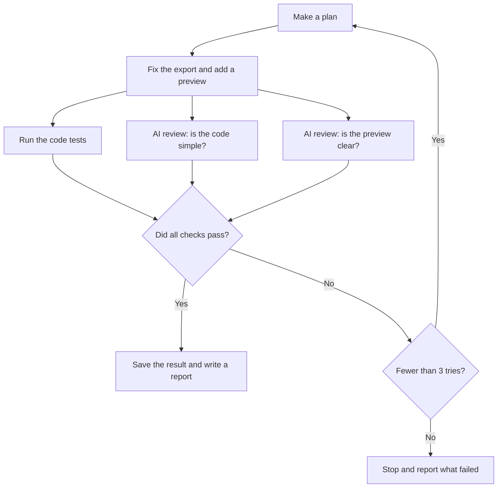

# How the workflow works

[Back to the app guide](../README.md) · [Run the workflow](RUN.md)

The goal is simple: fix the CSV download and let a person check the file before they download it.

Codex does the coding. Agentflow gives it the task, runs checks, and saves what happened. A **graph** is the file that tells Agentflow which steps to run. Ours is [agentflow.graph.json](../agentflow.graph.json).

## Follow the work

The three checks can run at the same time. All three must pass. If they do not, the next try gets notes about what went wrong. The workflow allows up to three tries.

The graph uses Agentflow's built-in `pattern_deep_work` to create these steps. The saved run passed on try one, so it did not use the retry path.

## What the checks look for

| Check | What it asks | How it decides |
| --- | --- | --- |
| Code tests | Does the app work as asked? | Runs the app tests and 29 export and preview checks. The command must pass. |
| Simple code | Is the fix easy to read and change? | An AI judge reads the code and gives a score. It must be at least 0.85 out of 1. |
| Clear preview | Can a person tell what they will download? | A second AI judge reads the screen text and how the code handles each case. It must score at least 0.85 out of 1. |

The code tests use fixed rules. In the graph, these are called **deterministic checks**. For example, the tests know that the active filter should export 103 customers. They can count the rows and check the answer.

Each AI judge gets a set of scoring rules, called a **rubric**. The judge must point to code or screen text to explain its score.

### Simple code

The judge checks that the fix fits this small app. It looks for shared filter rules, clear functions, and no extra features. It does not grade by line count or personal taste.

### Clear preview

The judge checks that the preview tells you:

- How many customers will be in the full file.
- Which filters and columns are in use.
- That the five rows shown are only a sample.
- How to download the file or cancel.
- What happens when no customers match.

It also checks that an old preview cannot describe a download with new filters.

**This judge reads the code. It does not check the page in a browser.** The first run shows why that matters: the words were clear, but the preview opened below the part of the page you could see. In the September 24 rerun, the preview opens in view, but a download control stays visible when loading fails. A separate browser check found that bug.

## How the total score works

| Part | Share of the total |
| --- | --- |
| Code tests | 60% |
| Simple code | 25% |
| Clear preview | 15% |

The total must reach **0.85 out of 1**. Each required check must also pass on its own. A high score from one judge cannot cover a failed test or a low score from the other judge.

The AI judges can read the app but cannot edit it. Agentflow also has a helper agent, called the **supervisor**, which can step in up to twice if needed. This is separate from the three-try review loop. It was not needed in the saved run.

## What the AI can change

The AI can change the app code and add tests. It must keep the task rules, customer data, workflow file, and files in `showcase/` as supplied. It must not remove tests or add extra packages.

The check tools have their own copy of the expected customer data. They do not use the app's code to decide what the right answer is.

## Exact instructions sent to the AI

The table below keeps the wording from the workflow file. It is useful if you want to check each rule. You can skip it when learning how the demo works.

Show the full instructions and scoring rules

| Field | Runtime audience | Exact text |
| --- | --- | --- |
| graph.intent.goal | worker / verifier / supervisor | Give Northstar operators a correct customer export and a clear preview of exactly what they will download. |
| graph.intent.acceptance_criteria.0 | worker / verifier / supervisor | The existing CSV export contract and the export preview contract are satisfied. |
| graph.intent.acceptance_criteria.1 | worker / verifier / supervisor | The implementation is focused and understandable, and the interface clearly distinguishes previewed samples from the full download. |
| graph.intent.acceptance_criteria.2 | worker / verifier / supervisor | The delivery includes actual validation evidence and a reviewable explanation. |
| graph.intent.constraints.0 | worker / verifier / supervisor | Do not edit data/customers.json, TICKET.md, or AGENTS.md. |
| graph.intent.constraints.1 | worker / verifier / supervisor | Do not weaken, remove, or skip existing tests. |
| graph.intent.constraints.2 | worker / verifier / supervisor | Do not edit files outside this repository or change independent acceptance tools. |
| graph.intent.constraints.3 | worker / verifier / supervisor | Do not add dependencies, call remote services, or include unrelated refactors. |
| graph.intent.constraints.4 | worker / verifier / supervisor | Do not edit EXPORT_PREVIEW.md or introduce unrelated interface redesign. |
| graph.intent.constraints.5 | worker / verifier / supervisor | Do not edit agentflow.graph.json, APP_GUIDE.md, or any file under showcase/. |
| graph.graph.intent.goal | worker / verifier / supervisor | Repair customer exports and add a preview that helps an operations user understand and confirm the complete download. |
| graph.graph.intent.acceptance_criteria.0 | worker / verifier / supervisor | CSV exports preserve all matching records and field values while customer listing remains paginated. |
| graph.graph.intent.acceptance_criteria.1 | worker / verifier / supervisor | The preview API satisfies EXPORT_PREVIEW.md for count, columns, and first-five matching sample records. |
| graph.graph.intent.acceptance_criteria.2 | worker / verifier / supervisor | The dashboard exposes a preview with active filter scope, sample labeling, download and cancel actions, and a useful no-match state. |
| graph.graph.intent.acceptance_criteria.3 | worker / verifier / supervisor | The preview and download use the same query, and stale preview information cannot silently describe a different download. |
| graph.graph.intent.acceptance_criteria.4 | worker / verifier / supervisor | Focused regression tests and the full product test suite pass. |
| graph.graph.intent.acceptance_criteria.5 | worker / verifier / supervisor | The summary documents changed files, actual validation evidence, user-visible states with source references, and limitations. |
| graph.graph.intent.constraints.0 | worker / verifier / supervisor | Do not edit data/customers.json, TICKET.md, or AGENTS.md. |
| graph.graph.intent.constraints.1 | worker / verifier / supervisor | Do not weaken, remove, or skip existing tests. |
| graph.graph.intent.constraints.2 | worker / verifier / supervisor | Do not edit files outside this repository or change independent acceptance tools. |
| graph.graph.intent.constraints.3 | worker / verifier / supervisor | Do not add dependencies, call remote services, or include unrelated refactors. |
| graph.graph.intent.constraints.4 | worker / verifier / supervisor | Do not edit EXPORT_PREVIEW.md or introduce unrelated interface redesign. |
| graph.graph.intent.constraints.5 | worker / verifier / supervisor | Do not edit agentflow.graph.json, APP_GUIDE.md, or any file under showcase/. |
| graph.graph.support.context.0.what | worker / verifier / supervisor | Customer export defect and observable acceptance contract. |
| graph.graph.support.context.0.why | worker / verifier / supervisor | The export must preserve the operator’s filters and every customer field. |
| graph.graph.support.context.1.what | worker / verifier / supervisor | Local commands, source layout, and public API semantics. |
| graph.graph.support.context.1.why | worker / verifier / supervisor | The repair must preserve existing listing behavior and public routes. |
| graph.graph.support.context.2.what | worker / verifier / supervisor | The operator-facing preview behavior and stable preview API contract. |
| graph.graph.support.context.2.why | worker / verifier / supervisor | Count, sample, filter scope, and download behavior must agree for the operator to make an informed decision. |
| graph.graph.artifacts.summary.description | worker / verifier / supervisor | Review handoff explaining the export repair and preview, changed files, actual validation results, user-visible state text with source references, and remaining limitations. |
| graph.graph.completion.criteria.1.rubric | rubric evaluator | Judge the changed implementation for simplicity and maintainability by inspecting actual source and the change evidence. A passing implementation is the smallest clear solution for this product: query/filter/order behavior is consistent between listing, export, and preview; responsibilities are understandable; added abstractions earn their complexity; and no unrelated rewrites, dependencies, dead code, or duplicated business rules are introduced. Accept justified small helpers and multiple files; do not use line count, file count, personal naming preferences, or a demand for one particular design as a proxy for simplicity. Cite concrete paths and explain the maintenance consequence of each substantive finding. Score 1.0 for a focused, easy-to-follow solution with no substantive issue; 0.85 for a clear solution with only optional nits; 0.70 for an identifiable maintainability problem requiring a small repair; 0.50 or below for substantial unnecessary complexity or conflicting business rules. Missing evidence is uncertainty to report, not permission to invent findings. Do not recommend a refactor unless its benefit is tied to observed code. |
| graph.graph.completion.criteria.2.rubric | rubric evaluator | Judge the clarity of the export preview from the implemented interface text and state handling in the source, supported by any actual UI observations recorded in the summary. A passing preview makes the full matching record count, active filter scope, exported columns, and first-five-record sample understandable to an operations user. It must distinguish the sample from the full download, provide unambiguous download and cancel actions, explain the no-match case, and avoid stale count/sample information being presented for a different query. Labels should describe the user's task rather than internal API or runtime details. Cite exact user-visible strings and source paths for findings. Score 1.0 when these decisions are immediately clear; 0.85 when they are clear with only optional wording improvements; 0.70 when a specific ambiguity could cause a wrong download decision; 0.50 or below when sample size, export scope, or actions are materially misleading or a required state is absent. Judge semantic clarity, not visual taste. Do not claim rendered layout, keyboard accessibility, or actual browser behavior was verified without corresponding observed evidence. Do not treat a confident summary as a substitute for implemented source. |

